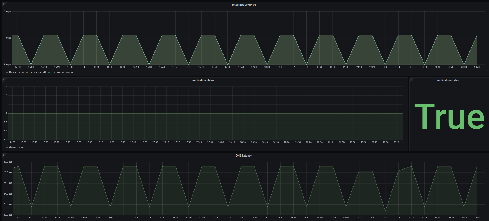

# DNS-Verifier
DNS-Verifier performs periodic DNS queries and compares the results with a set of defined acceptable answers. Results of verification as well as the RTT of the request are exposed using
a prometheus endpoint.

## How does it work?
DNS-Verifier consists of two components. One is a continuous loop that performs the desired DNS queries and the second is a web server that is used mainly for exposing the gathered metrics using prometheus framework.

After it gets a response for a DNS query it checks if there is an expected set of answers and response code and if there is, it compares those with the returned set of answers and response code. If the two match we mark this query run as valid otherwise we mark it as non valid. 

If there is no expected answers or response code specified we make the query and just store the RTT.
The verification status as well as the RTT of the request are exposed as prometheus metrics under `/metrics` endpoint. Using this endpoint you can scrape the service and store data in prometheus, where you can graph them or alert based on them.

Example of a grafana dashboard based on these data is:



## Configuration
### File
The declaration of the requests the tool wants to perfomr comes from a config file that (for now) is expected to live in `/etc/dns-verifier/config.yaml`.
The file contains a yaml list of the requests the tool will perform, an example one can see below:
```
requests:
  - domain: "thebeat.co"
    interval: 60
    queryType: "NS"
    resolver: 8.8.8.8
    expectedResponse:
      - "ns-416.awsdns-52.com."
      - "ns-1163.awsdns-17.org."
  - domain: thebeat.co
    interval: 5
    queryType: A
    expectedResponseCode: NOERROR
  - domain: my-svc.my-ns.svc.cluster.local
    queryType: SRV
```

Each request block can contain 5 key/value sections:
* `domain`: the domain that we will make the request about
* `interval`: the frequency that we will make the request for this domain in seconds. Default is 30.
* `queryType`: the DNS query type that we will ask (e.g A, AAAA, NS, etc)
* `resolver`: the resolver we will use to ask the DNS question. By default we will use local resolver found in `/etc/resolv.conf`.
* `expectedResponse`: a string list of expected answers that we want to validate the real answers with. This list should be an exact match of the returned answers (not a super/sub set of it).
* `expectedResponseCode`: the response code that we want our query to return. Currently we support only [NOERROR, NXDOMAIN, SERVFAIL] options.

The only required field are `domain` and `queryType`, if no expected answers or response code are specified the tool skips verification and just exports the RTT of the request.

### Environment
There are also several more global variables that you can set in the environment before starting the tool. 
* `DNS_VERIFIER_LOG_LEVEL`: sets the level of logging. Default is INFO.
* `DNS_VERIFIER_APP_PORT`: the port that the webserver will listen to.
* `DNS_VERIFIER_INTERVAL`: the default global interval in seconds that the requests will run, unless there is a one specified for a specific request. Default is 30.
